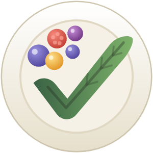
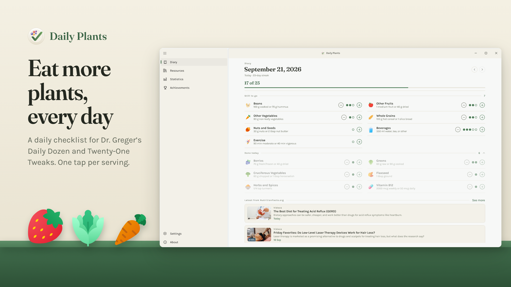
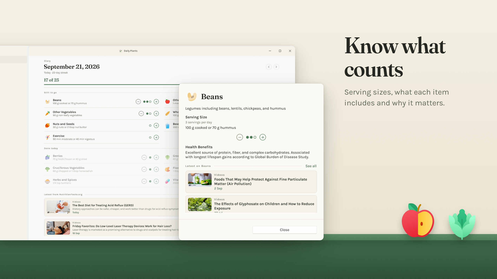
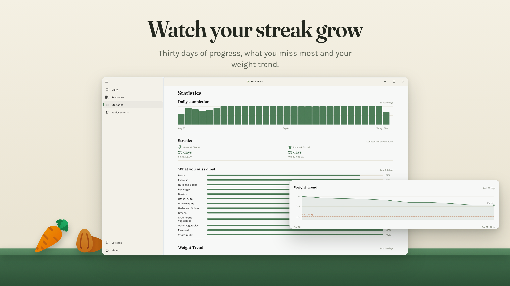
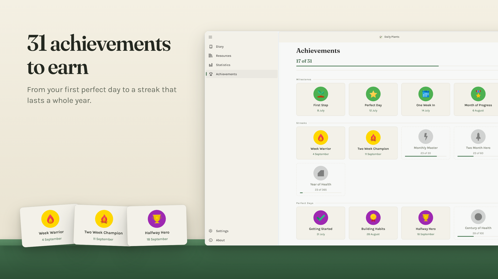
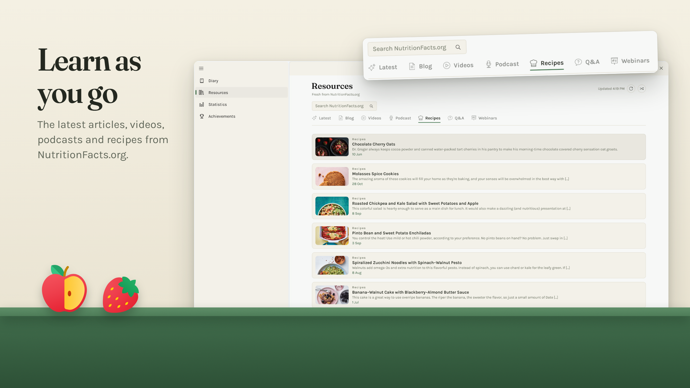
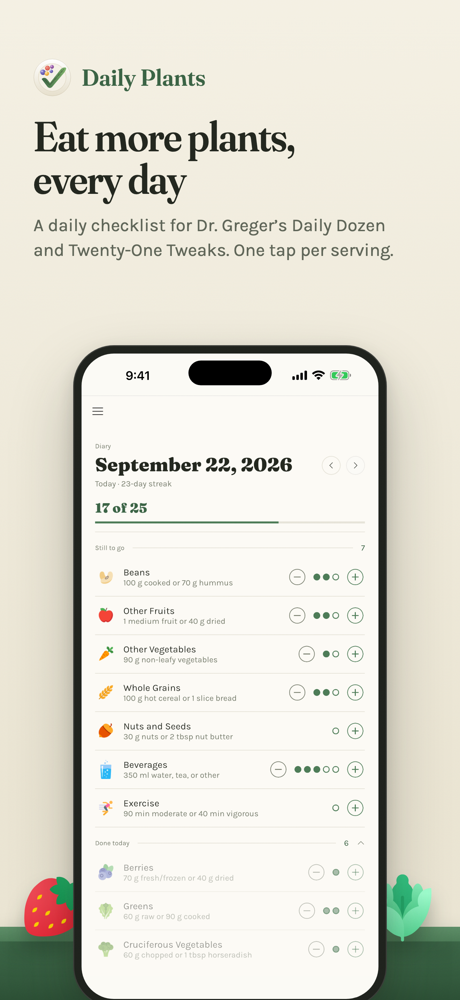
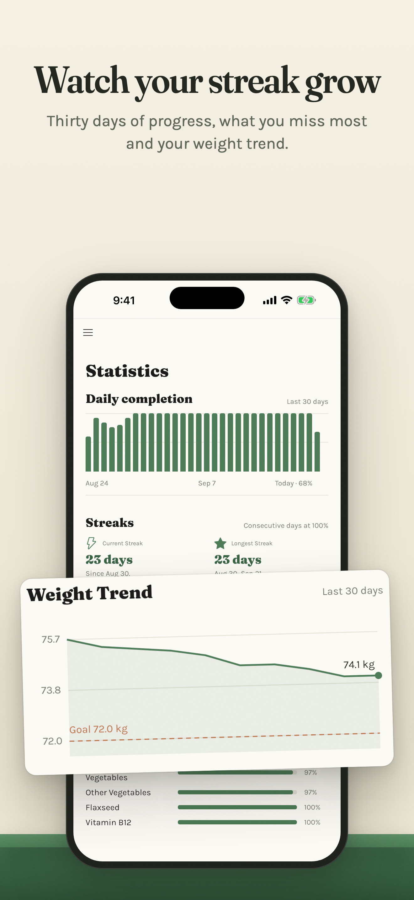
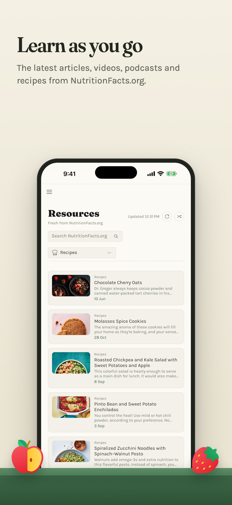
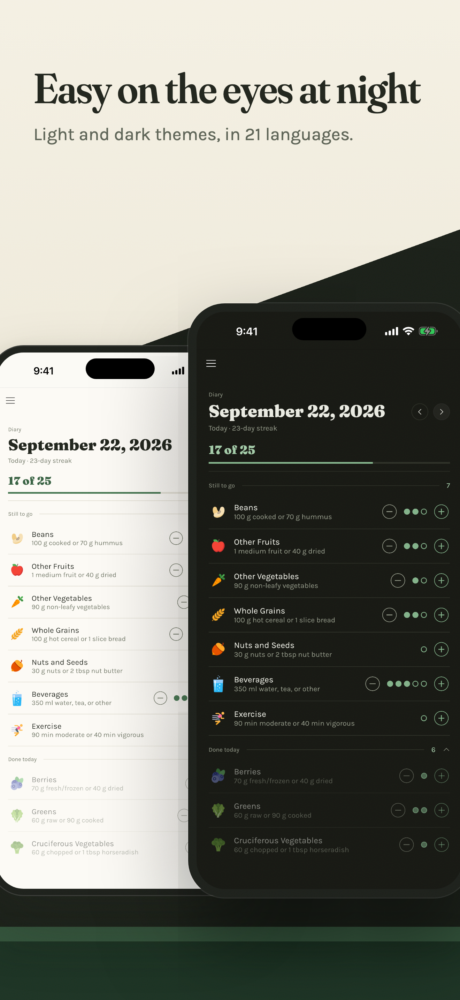

<p align="center">
  
</p>

<h1 align="center">Daily Plants</h1>

<p align="center">
  <strong>Eat more plants, every day.</strong><br>
  A calm, private checklist for Dr. Greger's Daily Dozen and Twenty-One Tweaks.<br>
  One tap per serving. No account, no ads, no tracking, no subscription.
</p>

<p align="center">
  <a href="https://apps.microsoft.com/detail/9NKK3K501RZG"></a>
</p>

<p align="center">
  <a href="https://github.com/MartinZikmund/daily-plants/actions/workflows/ci.yml"></a>
  <a href="https://github.com/MartinZikmund/daily-plants/releases/latest"></a>
  <a href="LICENSE"></a>
</p>



## Why Daily Plants?

You've read *How Not to Die* or *How Not to Diet*, and you're sold on beans, berries and greens. The hard part is remembering, on a busy Tuesday, whether you've had your flaxseed. Daily Plants turns the books into a checklist you can tick off in a few seconds a day:

- **Daily Dozen**: 12 food groups to eat every day, from *How Not to Die*.
- **Twenty-One Tweaks**: 21 habits from *How Not to Diet*, like drinking water before meals, adding vinegar and getting enough sleep.

Use one or both. Where they overlap, one serving counts toward both, so nothing gets counted twice.

## What's inside

- **Your day at a glance.** Tap + for each serving. Dots fill in, finished items drop down to *Done today*, and what's left stays on top.
- **Know what counts.** Tap any item for its serving size, which foods count and why it matters.
- **Streaks and statistics.** Thirty days of progress, your current and longest streak, and what you miss most.
- **31 achievements**, from your first perfect day to a streak that lasts a whole year.
- **Optional weight tracking** with a goal and a trend chart, in metric or imperial units.
- **Learn as you go.** The latest articles, videos, podcasts, recipes, Q&A and webinars from NutritionFacts.org, with search.
- **Missed a day?** Go back and fill it in.
- **Make it yours.** Turn off items you don't track, and pick a light or dark theme. High contrast works on Windows too.
- **21 languages**, from Bulgarian to Traditional Chinese.
- **Private by design.** Your diary stays on your device. The app only goes online to load the public NutritionFacts.org feeds. Export a full backup whenever you like and import it on another device.

## Take a look

<table>
  <tr>
    <td width="50%"></td>
    <td width="50%"></td>
  </tr>
  <tr>
    <td width="50%"></td>
    <td width="50%"></td>
  </tr>
</table>

And in your pocket:

<p align="center">
  
  
  
  
</p>

## Get it

| Platform | Where |
|----------|-------|
| Windows | [Microsoft Store](https://apps.microsoft.com/detail/9NKK3K501RZG) |
| iPhone and iPad | Coming soon to the App Store |
| Android | Coming soon to Google Play |
| Mac | Coming soon to the Mac App Store |
| Linux and the web | [Build it yourself](#build-it-yourself) |

## Build it yourself

Daily Plants is a single [Uno Platform](https://platform.uno/) project, so one codebase runs everywhere.

### Prerequisites

- [.NET 10 SDK](https://dotnet.microsoft.com/download/dotnet/10.0)
- Visual Studio 2026, JetBrains Rider or VS Code with the [Uno Platform extension](https://platform.uno/docs/articles/get-started.html)
- [uno-check](https://platform.uno/docs/articles/external/uno.check/doc/using-uno-check.html) to install the workloads you need: `dotnet tool install -g uno.check`, then `uno-check`
- Android: an Android SDK (API 24 or later)
- iOS: a Mac with Xcode

### Run it

The quickest way to see it running is the Skia desktop head, which works on Windows, macOS and Linux:

```bash
git clone https://github.com/MartinZikmund/daily-plants.git
cd daily-plants/src/DailyPlants
dotnet run -f net10.0-desktop
```

Or open `DailyPlants.slnx`, pick a target framework and press F5:

| Target | Framework |
|--------|-----------|
| Windows (WinAppSDK) | `net10.0-windows10.0.26100` |
| Desktop (Skia) | `net10.0-desktop` |
| Android | `net10.0-android` |
| iOS | `net10.0-ios` |
| WebAssembly | `net10.0-browserwasm` |

### Run the tests

```bash
dotnet test tests/DailyPlants.Tests/DailyPlants.Tests.csproj
```

## Under the hood

- [Uno Platform](https://platform.uno/) with the Skia renderer, WinUI XAML and Fluent Design
- [CommunityToolkit.Mvvm](https://learn.microsoft.com/dotnet/communitytoolkit/mvvm/) for view models, Uno.Extensions hosting for dependency injection
- SQLite through [sqlite-net](https://github.com/praeclarum/sqlite-net), stored in the app's local data folder
- MSTest, Moq and FluentAssertions for tests
- [Nerdbank.GitVersioning](https://github.com/dotnet/Nerdbank.GitVersioning) for versions

```
src/DailyPlants/     The app: Views, ViewModels, Models, Services, Controls, Styles, Strings
tests/               Unit tests
docs/store/          Store listings and the pipelines that render the screenshots above
docs/design/         Design notes
assets/app-icon/     App icon sources
```

The Store listings and every screenshot in this README are generated from the repo. See [docs/store/windows](docs/store/windows/README.md), [docs/store/ios](docs/store/ios/README.md) and [docs/store/macos](docs/store/macos/README.md) if you want to rerun them.

## Contributing

Bug reports, translations and pull requests are welcome. Read the [contributing guidelines](CONTRIBUTING.md) first, and see [CHANGELOG.md](CHANGELOG.md) for what changed in each release. For security concerns, see the [security policy](SECURITY.md).

## License

[MIT](LICENSE). Third-party notices are in [THIRD-PARTY-NOTICES.md](THIRD-PARTY-NOTICES.md).

## Thanks

- [Dr. Michael Greger](https://nutritionfacts.org/) for the Daily Dozen and the Twenty-One Tweaks
- [NutritionFacts.org](https://nutritionfacts.org/) for keeping evidence-based nutrition free for everyone
- [Uno Platform](https://platform.uno/) for the cross-platform framework
- Everyone behind the open-source libraries this app stands on

## Disclaimer

Daily Plants is an independent app and is not affiliated with or endorsed by Dr. Michael Greger or NutritionFacts.org. It isn't medical advice, so talk to your doctor before making big changes to your diet.
